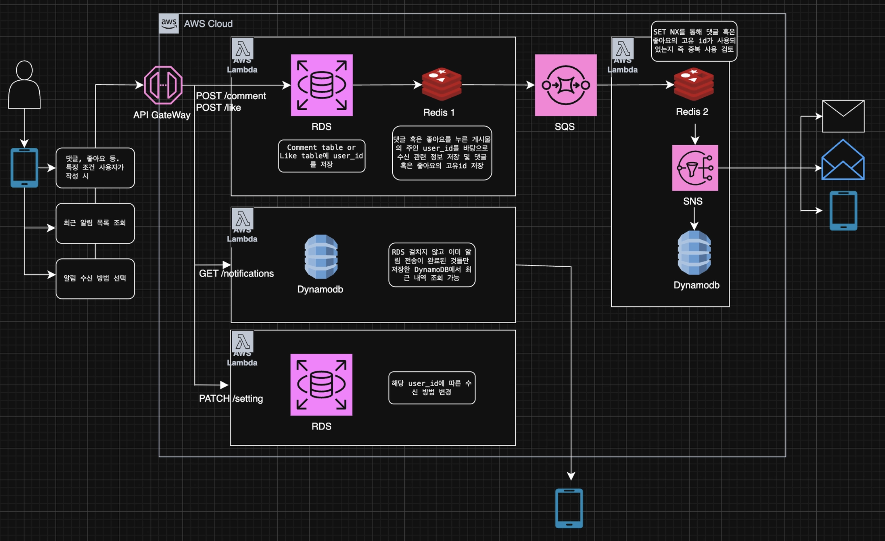

1. 한국 고객을 대상으로 서비스한다.
2. 서비스는 iOS 모바일 앱을 제공하며, 푸시 알림은 각 플랫폼의 알림 시스템을 통해 전송된다.
3. 사용자는 댓글, 좋아요 등 특정 조건이 충족되면 알림을 받는다.
    1. API
4. 사용자는 알림 수신 방법을 선택할 수 있다. 서비스는 SMS, 이메일, 푸쉬 알림을 제공한다.
    1. RDS
5. 사용자는 하나 이상의 알림 수신 방법을 선택할 수 있다.
    1. API
6. 알림 전송에 실패할 경우 재시도되어야 하며, 알림이 유실되면 안된다.
    1. 데드 레터 큐를 만들어서 검사
    2. Lambda 코드에서 전송 실패 시 반드시 raise를 통해 에러를 발생시켜 재시도 sqs 재시도 대상으로 분류
7. 가능한 한 중복 전송을 방지해야 한다.
    1. 레디스
8. 사용자는 최근 알림 목록을 조회할 수 있다.
    1. API
9. 알림은 가능한 빠르게 전송되어야 한다.
    1. 레디스 
10. 특정 시간대에 알림이 몰릴 수 있다.
    1. SQS 사용. 음
11. 초기에는 단순한 구조로 시작하고, 트래픽 증가에 따라 확장 가능한 구조를 고려한다.

